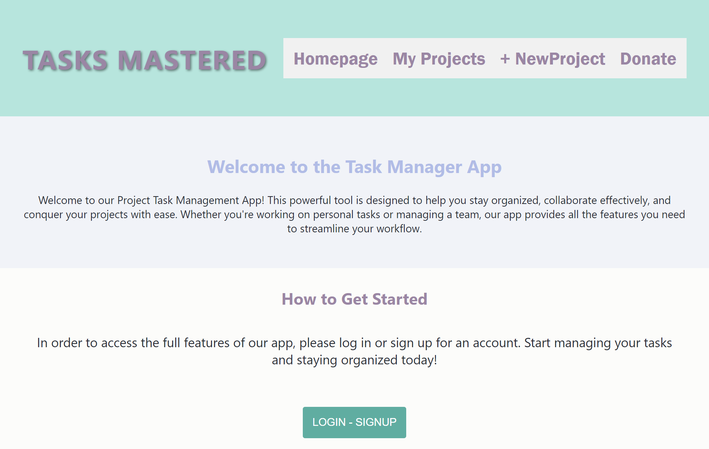
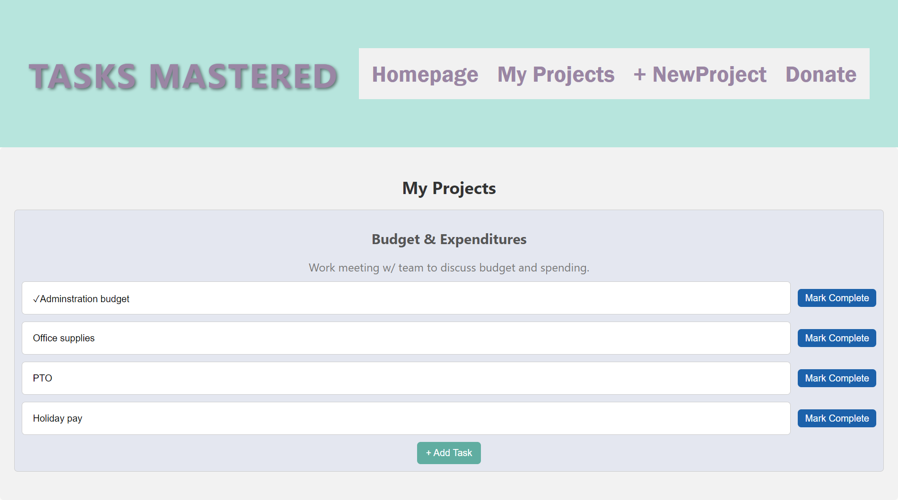

# tasks-mastered

## Description
Tasks Mastered App is a simple yet powerful tool designed to help you stay organized and efficient in managing your tasks and projects. This app was built using the MERN stack and utlizes dynamic libraries such as Apollo-Server, Apollo-Client, and Stripe. Whether you're a busy professional, a student, or just someone who wants to keep track of their to-do list, this app is here to simplify your life. 


## Table of Contents 
- [Usage](#usage-)
- [Deployed Application](#deployed-application-)
- [License](#license-)
- [Contributing](#contributing-)


## Usage
***
To use this app, you'll need to have Node.js installed on your computer. Once you have those installed, you can follow these steps:


To install the necessary dependencies, please use:
```
npm install
```

To invoke application from the terminal and continue development use the following command:
```
npm run develop
```

## Deloyed Application: [https://serene-tundra-36250.herokuapp.com/](https://serene-tundra-36250.herokuapp.com/)





 ## License 
    This application is covered by the MIT license.
 

 ## Contributing
 - Dannika Long [GitHub](https://github.com/dannikaml)
 - Buddhasak Vongsavath [GitHub](https://github.com/SirTumtums)
 - Alexandra Munn [GitHub](https://github.com/alexandramunn)

### Sources

youtube:
- https://www.youtube.com/watch?v=k4lHXIzCEkM
- https://www.youtube.com/watch?v=O8IipcpTmYU

geeksforgeeks:
- https://www.geeksforgeeks.org/mern-stack/

stackoverflow:
- https://stackoverflow.com/questions/54936409/post-400-bad-request-react-node-express-mongodb

postman:
- https://community.postman.com/t/how-to-resolve-400-bad-request-errors-on-post-request-for-a-sample-mern-application/32409

ChatGPT; Instructor: Bassie Bangura; TA: Ethan Dogden